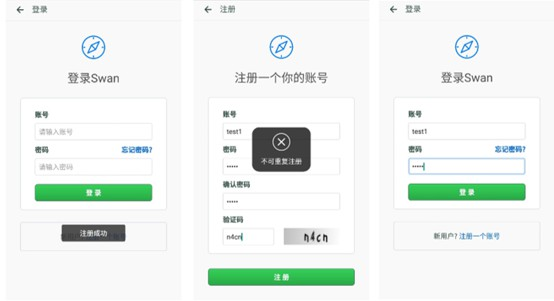
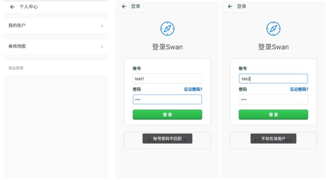
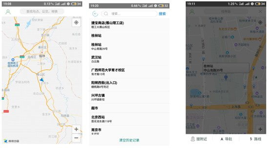
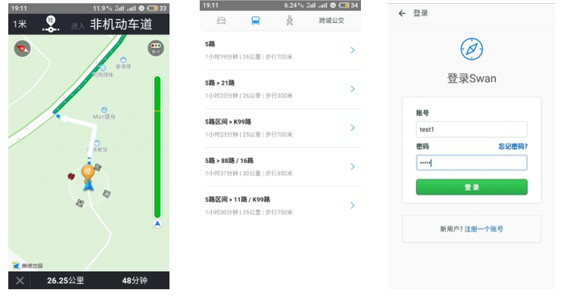
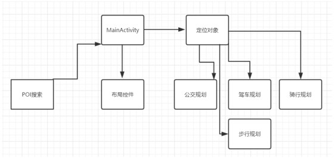
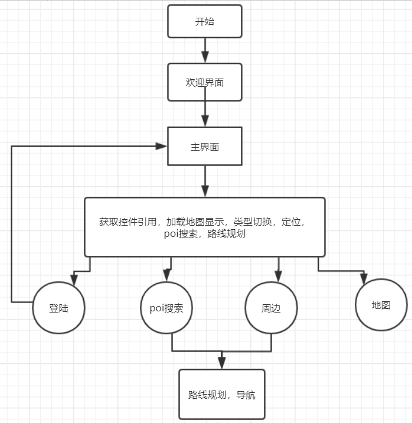
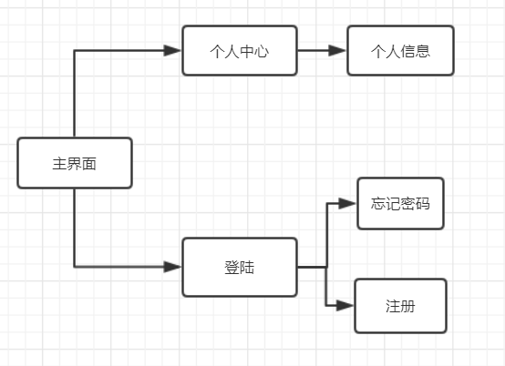
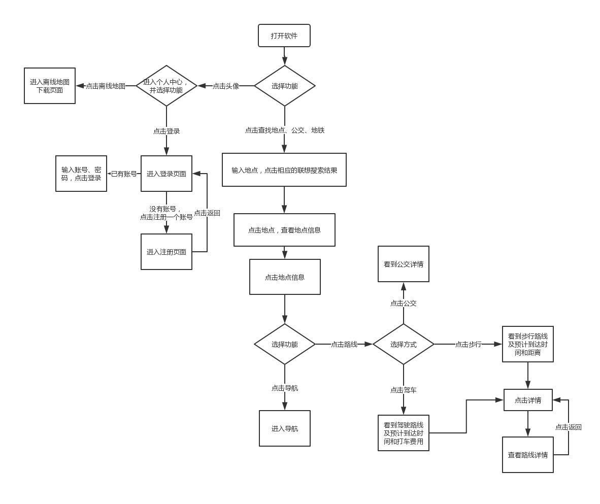

## 鸿鹄导航-Swan
### 1.项目简介
> 本软件（鸿鹄导航，英文：Swan，后面称鸿鹄导航）主要通过使用高德地图API完成基本的地图显示及放大缩小、实时定位、地址搜索、规划路线、导航、搜索历史记录等功能，并自定义实现注册登录功能。并在注册登录、搜索历史记录模块实现数据持久化，同时，路线规划提供驾车、公交、步行、跨城公交四种方式的路线规划，并且会计算出打车费用，以及驾车、公交、步行所需的时间，还有详细的路线规划详情，另外，还提供了全国各城市的离线地图下载。

### 2.项目所能达到的功能
- （1）地图的显示
- （2）地图的放大缩小
- （3）实时定位
- （4）地址搜索
- （5）路线规划
- （6）驾车导航
- （7）公交路线
- （8）步行导航
- （9）跨城公交路线
- （10）搜索的历史记录（数据持久化）
- （11）登录（数据持久化）
- （12）注册（数据持久化）
- （13）离线地图下载

### 3.使用
项目主要分为两个部分：
- 服务器端 —— swan-server
- 客户端 —— swan-client
#### 客户端 —— swan-client
- 目录结构：

```
.
│  AndroidManifest.xml
│  ic_launcher-web.png
│
├─java
│  └─com
│      └─example
│          └─swan
│              │  FuncOfMap.java
│              │  MainActivity.java
│              │
│              ├─activity
│              │      AccountActivity.java
│              │      Constants.java
│              │      LoginActivity.java
│              │      MenuActivity.java
│              │      RegisterActivity.java
│              │      SearchActivity.java
│              │
│              ├─adapter
│              │      InputTipsAdapter.java
│              │
│              ├─config
│              │      CommonConfig.java
│              │
│              ├─domain
│              │      Message.java
│              │
│              ├─helper
│              │      NotificationHelper.java
│              │
│              ├─listener
│              │      PointTouchClickListener.java
│              │
│              ├─navi
│              │      ErrorInfo.java
│              │      NaviActivity.java
│              │
│              ├─overlay
│              │      BusLineOverlay.java
│              │      BusRouteOverlay.java
│              │      DrivingRouteOverlay.java
│              │      PoiOverlay.java
│              │      RideRouteOverlay.java
│              │      RouteOverlay.java
│              │      WalkRouteOverlay.java
│              │
│              ├─route
│              │      BusResultListAdapter.java
│              │      BusRouteDetailActivity.java
│              │      BusSegmentListAdapter.java
│              │      ChString.java
│              │      DriveRouteDetailActivity.java
│              │      DriveSegmentListAdapter.java
│              │      RideRouteDetailActivity.java
│              │      RideSegmentListAdapter.java
│              │      RouteActivity.java
│              │      SchemeBusStep.java
│              │      WalkRouteDetailActivity.java
│              │      WalkSegmentListAdapter.java
│              │
│              └─util
│                      AccountHelper.java
│                      AMapServicesUtil.java
│                      AMapUtil.java
│                      CommonUtil.java
│                      HttpUtil.java
│                      QMUITipDialogUtil.java
│                      ToastUtil.java
│
└─res
    ├─drawable
    ├─drawable-v24
    ├─layout
    ├─mipmap-anydpi-v26
    ├─mipmap-hdpi
    ├─mipmap-mdpi
    ├─mipmap-xhdpi
    ├─mipmap-xxhdpi
    ├─mipmap-xxxhdpi
    └─values
```
#### 服务器端 —— swan-server
- 目录结构:
```
.
├─java
│  └─com
│      └─example
│          └─swan
│              └─swanserver
│                  │  SwanServerApplication.java
│                  │
│                  ├─config
│                  │  │  Constants.java
│                  │  │  KaptchaConfig.java
│                  │  │  MvcConfig.java
│                  │  │
│                  │  ├─anno
│                  │  │      AuthTokenMethod.java
│                  │  │      AuthTokenRequired.java
│                  │  │      KaptchaRequired.java
│                  │  │
│                  │  └─interceptors
│                  │          AuthTokenInterceptor.java
│                  │          KaptchaInterceptor.java
│                  │
│                  ├─controller
│                  │      AccountController.java
│                  │      MessageController.java
│                  │
│                  ├─dao
│                  │      AuthUserMapper.java
│                  │
│                  ├─model
│                  │  │  Message.java
│                  │  │
│                  │  └─po
│                  │          AbstractAuthUser.java
│                  │          DefaultAuthUser.java
│                  │
│                  ├─security
│                  │      JsonWebTokenUtil.java
│                  │      JwtAccount.java
│                  │
│                  ├─service
│                  │  │  AccountService.java
│                  │  │  KaptchaService.java
│                  │  │  MessageService.java
│                  │  │  RedisService.java
│                  │  │
│                  │  └─impl
│                  │          AccountServiceImpl.java
│                  │          KaptchaServiceImpl.java
│                  │          MessageServiceImpl.java
│                  │          RedisServiceImpl.java
│                  │
│                  └─util
│                          CommonUtil.java
│                          HttpUtil.java
│
└─resources
    │  application.yml
    │
    └─mapper
            AuthUser.xml
```
#### 客户端的使用
> 具体的一些工程配置步骤见: [高德地图API](https://lbs.amap.com/api/android-sdk/summary/) :  https://lbs.amap.com/api/android-sdk/summary/

> 主要需要修改key值：
下面meta-data标签中的value值，为根据自己实际情况生成的key值，具体生成key值的步骤参考 [获取key](https://lbs.amap.com/api/android-sdk/guide/create-project/get-key) : https://lbs.amap.com/api/android-sdk/guide/create-project/get-key

```xml
//AndroidManifest.xml
<meta-data
    android:name="com.amap.api.v2.apikey"
    android:value="f26c29924428f8738e37242f6ae5254b" />
```
> 注意gradle的版本：本项目使用的是3.2.0
```java
//build.gradle
dependencies {
    classpath 'com.android.tools.build:gradle:3.2.0'
}
```
#### 服务器端的使用
> 待完成。。。


### 附录
#### 1.软件部分截图




#### 2.功能模块图

#### 3.整体流程图

#### 4.界面流程图

#### 5.简易流程图



